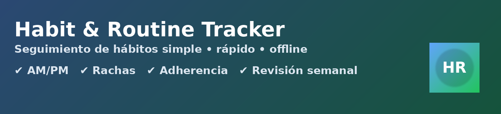

<p align="center">
  
</p>

<h1 align="center">Habit & Routine Tracker</h1>
<p align="center">
  PWA local‑first para seguir hábitos fácilmente: AM/PM, rachas, adherencia, revisión semanal, backups (JSON/HRZ), PIN y soporte offline.
</p>

<p align="center">
  <a href="https://mcruizgo.github.io/habit-tracker/"><b>➡️ Abrir la app</b></a>
</p>

---

## ✨ Features
- **PWA** instalable (móvil/desktop), **offline** con Service Worker.
- **Local-first**: datos en tu dispositivo (IndexedDB + persistencia solicitada).
- **PIN** de apertura (4–8 dígitos) y **auto‑bloqueo**.
- **Hábitos** con AM/PM, **objetivo diario** (>1), **días de la semana**, reordenar (drag & drop / ↑↓), archivar.
- **Hoy** con contador por hábito (x/objetivo) y deshacer (5 s).
- **Estadísticas Pro**: racha, adherencia 30 días, **calendario de calor**.
- **Revisión semanal**: qué funcionó, ajustes y un “win” (histórico por semanas).
- **Backups**: `backup.json` (plano) y **`.hrz` cifrado** (AES‑GCM + PBKDF2).
- **Importación con merge**: fusiona datos por nombre de hábito.
- **Multitab**: sincroniza cambios entre pestañas con BroadcastChannel.
- **i18n** ES/EN y pequeños recordatorios suaves (in‑app) en franjas AM/PM.

## 🚀 Despliegue en GitHub Pages
1. Crea el repo público (ej. `habit-tracker`) y sube:
   - `index.html`
   - `sw.js`
   - `manifest.webmanifest`
   - carpeta `assets/` con los iconos y las imágenes del README
2. Settings → **Pages** → Source: *Deploy from a branch* → Branch: `main` → Folder: `/`.
3. URL: `https://TU_USUARIO.github.io/TU_REPO/` (sustituye TU_USUARIO/TU_REPO).
4. Abre la URL, espera 2–3 s y recarga (instala el SW). Luego **Instalar** en tu móvil.

## 📱 Instalación como PWA
- **Android (Chrome)**: menú ⋮ → *Instalar app* (o *Añadir a pantalla principal*).
- **iPhone (Safari)**: **Compartir** → *Añadir a pantalla de inicio*.
- iOS ya está soportado con meta‑tags y safe areas.

## ⚙️ Integración de iconos/manifest
Asegúrate de tener en `<head>`:
```html
<link rel="manifest" href="manifest.webmanifest">
<link rel="icon" type="image/png" sizes="192x192" href="assets/icon-192.png">
<link rel="icon" type="image/png" sizes="512x512" href="assets/icon-512.png">
<link rel="apple-touch-icon" href="assets/apple-touch-icon-180.png">
<meta name="theme-color" content="#60a5fa">
<meta name="apple-mobile-web-app-capable" content="yes">
<meta name="apple-mobile-web-app-status-bar-style" content="black-translucent">
<meta name="viewport" content="width=device-width, initial-scale=1, viewport-fit=cover">
<meta name="format-detection" content="telephone=no">
```

## 🧩 Service Worker
`sw.js` usa **cache‑first** para estáticos y **fallback de navegación** a `index.html` cuando estás offline. Si tras una actualización no ves cambios:
- Cierra la app instalada y vuelve a abrir la **URL** en el navegador → recarga.
- O incrementa el nombre de caché en `sw.js` (ej. `hr-cache-v7`) y haz commit.

## 🔐 Privacidad y PIN
- Tus datos residen **solo** en tu dispositivo (IndexedDB/localStorage).
- El **PIN** y auto‑bloqueo se gestionan localmente. Si lo olvidas, puedes borrar datos desde la pantalla de bloqueo e **importar** un backup.
- Para almacenar en la nube, usa el backup **`.hrz` cifrado** con contraseña.

## 🗃️ Backups (no subir al repo público)
Crea un `.gitignore` con:
```gitignore
# No subas tus datos personales del tracker
habit-backup.json
*.hrz
```
Si subiste un backup por error:
1) bórralo con un nuevo commit; 2) cambia el PIN; 3) genera un nuevo backup. Si quieres, purga el histórico del repo con BFG o `git filter-repo`.

## 🧪 Verificación rápida
- Marca hábitos, revisa **Estadísticas** y el **calendario de calor**.
- Instálala como PWA, activa modo avión y comprueba que abre **offline**.
- Prueba **backup.json** y **.hrz** (cifrado) y la **importación con merge**.

## 🐛 Problemas comunes
- **No aparece “Instalar app” en Android**: usa *Añadir a la pantalla principal* igualmente.
- **iPhone no a pantalla completa**: borra el acceso previo y repite *Añadir a pantalla de inicio*.
- **El arrastre no funciona en iOS**: usa los botones **↑/↓** para reordenar.
- **Los cambios no se ven**: recarga 1–2 veces; el SW actualizará la caché.

---

<p align="center">
  Hecho con ❤️ para un uso personal, local y privado.
</p>
